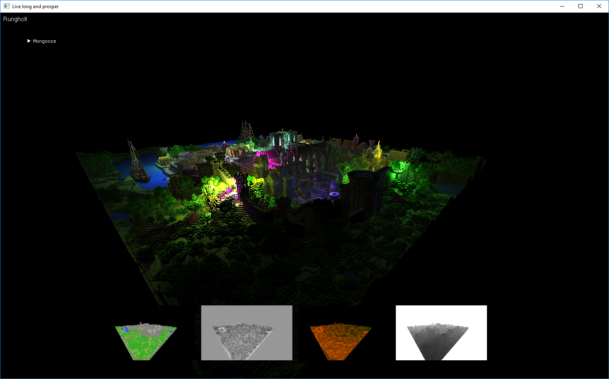

## Mongoose
### Minimalistic Vulkan engine for fast prototyping.
    Windows and Linux(Tested with Arch Linux)
    Support for free type text rendering
    Dear ImGui visualization
    Tightly coupled with files generated from the Shader-Compiler*

#### Dependencies
    freetype-2.6.2
    glfw-3.2.1
    glm
    imgui
    lodepng
    tiny_gltf
    
#### Prerequisites
    Environment variable *VULKAN_SDK* has to be set
    Windows, *VS studio* >= 2017
    Linux, *Clang and libc++* >= 8.0
    *cmake* >= 3.12

#### Deferred rendering with SSAO(unzip rungholt.zip before running)

#### RTX, Ray Tracing in a weekend + Sobol Sequence and blue noise for quasi monte carlo

#### Compute shader, N-Body simulation with tone mapping

#### Fluid simulation based on Navier-Stokes equations 

#### Physically based shading from gltf-model

#### Memory allocator visualization using dear IMGUI

#### Isosurface rendering from volume data

#### Space invaders
    Instancing with SSBO
    SIMD(avx) for collision detection and translation.
    Collision algorithm: Grid coordinates -> hash map -> linked list in array
    No heap allocation during each frame

##### *http://github.com/kruseborn/shader-compiler
